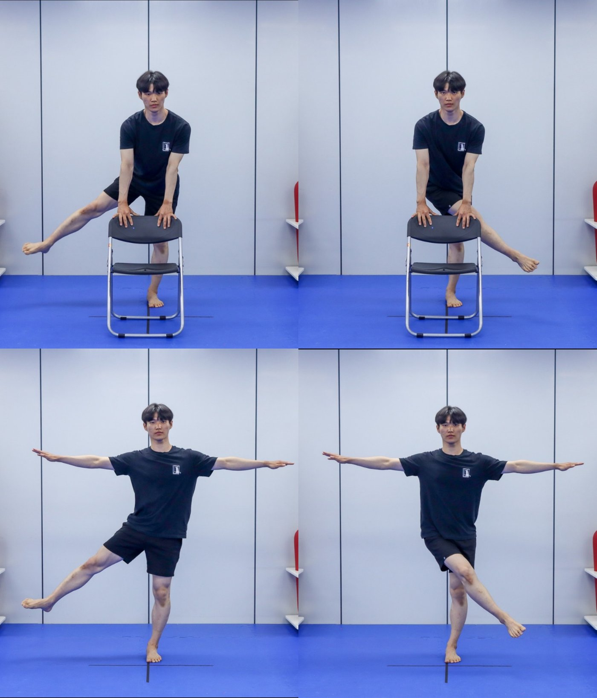

## Research

I am interested in how muscles coordinate to produce human movement. Beyond describing movement itself, I aim to study how motor commands from the central nervous system regulate muscle activity.

Using multi-channel electromyography (EMG) and NMF-based muscle synergy analysis, I examine how muscle coordination and postural control adapt during repetitive tasks and in response to unexpected perturbations.

Directions I want to take further:

- Measuring what surface EMG cannot reach — deep and trunk muscles, and activity closer to the motor-unit level
- Synthetic EMG and neuromusculoskeletal digital twins linking neural drive, motor units, and muscle force
- Subject-specific models that prescribe, not just describe, what an individual should change
- Muscle coordination with anticipatory postural responses

## Skills / Methods

- EMG, motion capture, and force-plate data collection and analysis (16-channel wireless EMG (Delsys), 14-camera Motive, 4 force plates)
- NMF muscle-synergy analysis
- Deep learning (CNN) for movement and EMG data classification in Python
- Python and R for data analysis, processing pipelines, and automation

## Education

- [Cheongju University, Dept. of Sports Rehabilitation](https://www.cju.ac.kr/sptrehab/index.do), M.S. in Sports Medicine, 2025–2027 (expected)
  - Advisor: [Prof. Yushin Kim](https://scholar.google.co.kr/citations?user=hdV_QJMAAAAJ&hl=en)
  - GPA: 4.00/4.00
- [Hanyang University ERICA, Sports Coaching Major](http://sportsnarts.hanyang.ac.kr/en/sport/), 2019–2025 (including two years of mandatory military service)
  - GPA: 3.62/4.00

## Grants

- Master's Student Research Grant, National Research Foundation of Korea. "Predicting Fall Risk in Older Adults Using Muscle Synergy Analysis and Convolutional Neural Networks (CNN)." Principal Investigator. KRW 12,000,000 (approx. USD 8,700). 2026–2027.

## Research Activities

### Master's (2025-2027)

- Conducted biomechanics experiments with 33 young adults and 40 community-dwelling older adults in Cheongju; for the older-adult cohort, recruited participants, delivered an individualized fall-risk assessment report to each participant, and taught tailored fall-prevention exercise programs based on the results
  - Built an [automated fall-risk assessment & reporting system](https://github.com/Rukkha1024/elderly-balance-assessment-public) that grades fall risk from experimental data (TUG, gait, one-leg-standing, questionnaires) and auto-generates each participant's PDF report
  - Building on this dataset, analyzing how young and older adults differ in their responses to unexpected perturbations in unconstrained environments, focusing on stepping vs. non-stepping strategies (ongoing)
- Analyzed muscle coordination structures in the gait of patients with brain lesions using muscle synergy analysis, applying k-means clustering to compare synergies between groups
- Studied the effect of biomechanically improved manual-handling equipment on users’ muscle activation[*](https://doi.org/10.24332/aospt.2025.21.2.12)

### Undergraduate (2019-2025)

- Studied motor-skill learning in the clean & jerk weightlifting movement[*](https://github.com/Rukkha1024/Clean-Jerk-Improvement-after-3-Weeks-of-Training)
- Studied how warm-up affects golf-swing performance

## Other Activities

- Fall-prevention exercise curriculum co-author & instructor for older adults, 2025
  - Co-authored the fall-prevention exercise teaching materials, used in both the specialist instructor training course and the older-adult education program, and taught as an instructor
  - Participated in the 2025 Fall Prevention Specialist Instructor Training Course (BASIC), organized by the Korea Disease Control and Prevention Agency and the National Injury Management Center (operated by Korea University)
  - Demonstrated and instructed fall-prevention exercises such as balance assessment and lower-limb strengthening as part of the practicum in Cheongju University's Dept. of Sports Rehabilitation, and conducted prevention education for actual older adults ([related news](https://www.sisanews.org/articles/224088838594))

  {: style="width:30%"}
  *Featured in the co-authored teaching materials.*

## Hobbies

- Artistic gymnastics
- Strength & functional training
- Workflow automation with Python
